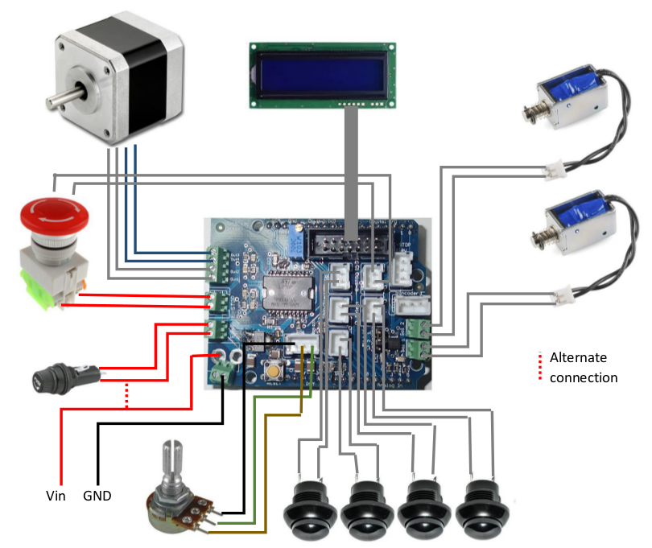
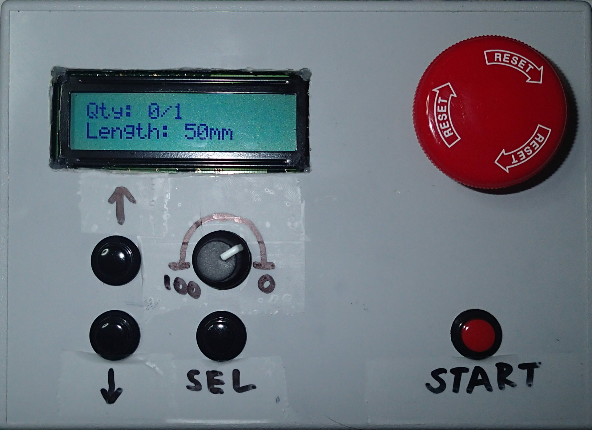

# Arduino-cutter
Arduino controller implementation of a plastic or resistor cutter.

The controller daughter board contains the follow external board connections;

 * 6 -> 14v
 * Four push-buttons
 * Adjustable potentiometer
 * E-stops
 * 4-bit LCD
 * Single pulse encoder
 * Two solenoid relays, active low, 5v or Vin
 * Stepper motor, 2A
 * Fuse connector

## Hardware Setup

The parts required and the daughterboard PCB Gerber files are located in the EagleBoard folder.

The interfacing of the components is as follows.






## Installing

1. Clone this repository

 ```sh
 git clone https://github.com/Heych88/Arduino-cutter.git
 ```

2. Download Arduino IDE from [here](https://www.arduino.cc/en/Main/Software).

3. If you are installing a brand-new Arduino Leonardo board, the EEPROM must be flashed first. If it is the existing system board, continue from step 4.

 1. Load the `eeprom_write.ino` file, located in the `/src/eeprom_write/` folders, into the Arduino IDE.

 2. Compile and load the file onto the Arduino board.

4. Load any of the `.ino` files, located in the `/src/` folders, into the Arduino IDE.

5. Compile and load the files onto the Arduino board.

Detailed programming and system information can be found in the *Arduino Cutter Instructions* document, located in the `/documents/` folder.

## Usage

This repository provides a daughterboard and usable code to run an Arduino plastic or resistor cutter.

## Contributing

1. Fork it!
2. Create your feature branch: `git checkout -b my-new-feature`
3. Commit your changes: `git commit -am 'Add some feature'`
4. Push to the branch: `git push origin my-new-feature`
5. Submit a pull request :D

## License

This project is licensed under the GNU-GPL3 License - see the [LICENSE.md](LICENSE.md) file for details.
